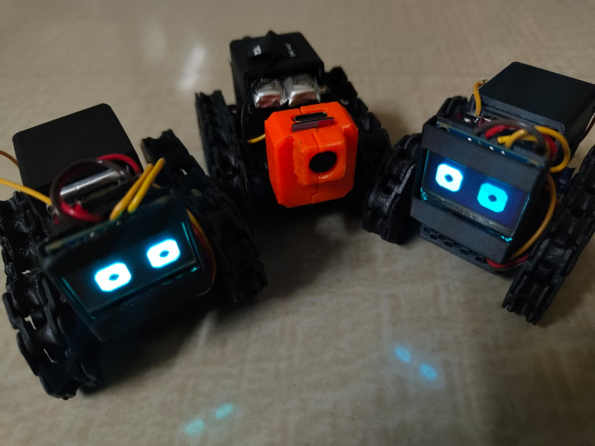
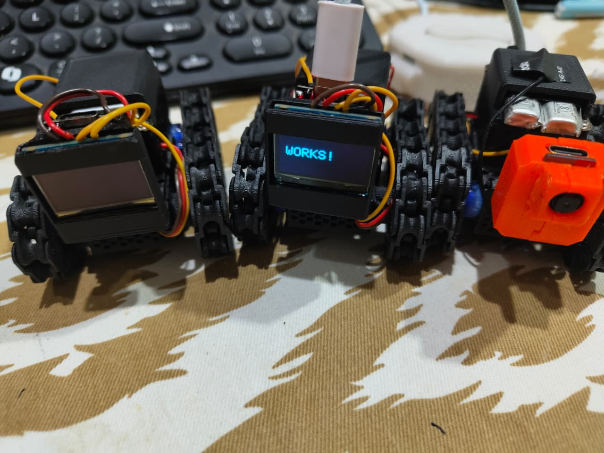

# T-01: The Explorer

The first model in the **Explorer Series**: an ESP32-C3 powered wireless robotic tank with continuous-servo differential steering and expressive OLED eyes.

## Overview

**T-01: The Explorer** is a compact tracked robot built around the **ESP32-C3**. It uses **ESP-NOW** for low-latency wireless communication, drives with **two continuous rotation servos**, and features an **SSD1306 OLED display** that renders animated eyes for visual feedback and personality.

This repository contains **only the tank-side firmware**.

## Features

- ESP-NOW wireless control receiver
- Differential steering with two continuous rotation servos
- Animated OLED eyes inspired by the Intellar style
- Motion-reactive eye behavior
- Fast real-time response
- Compact and upgrade-friendly robot platform

## Hardware

- ESP32-C3
- 2x continuous rotation servo motors
- SSD1306 OLED display (I2C)
- 3.7V Li-ion battery
- TP4056 charging module
- SX1308 DC-DC step-up converter
- Power switch
- Tank chassis / tracked platform

## Connections

### Signal Connections

| Component | Connection | ESP32-C3 Pin |
| --- | --- | --- |
| OLED Display | SDA | GPIO 4 |
| OLED Display | SCL | GPIO 3 |
| Left Servo | Signal | GPIO 5 |
| Right Servo | Signal | GPIO 6 |

### Power Connections

| Module | Power Connection |
| --- | --- |
| Li-ion Battery | Connected to TP4056 `B+` and `B-` |
| TP4056 Output | Connected to the power switch |
| Power Switch Output | Connected to SX1308 input |
| SX1308 Output | Powers ESP32-C3, OLED, and both servos |
| All Modules | Share a common ground |

## Requirements

- ESP32-C3 board support installed in Arduino IDE
- SSD1306 OLED wired over I2C
- Continuous rotation servos powered from a stable supply
- SX1308 adjusted to the correct output voltage for your build
- A separate ESP-NOW transmitter/controller

## How It Works

1. The ESP32-C3 receives control data over ESP-NOW.
2. Incoming throttle and steering values are processed by the firmware.
3. The left and right servos are driven independently for differential steering.
4. The OLED display updates its animated eyes based on robot motion and state.

## Differential Steering

The tank moves by controlling the speed and direction of each track side independently:

- Both servos forward: move forward
- Both servos reverse: move backward
- One side slower than the other: gradual turn
- Opposite directions: pivot in place

## Repository Scope

This repository is intended for the **robot firmware only**. If you later build a separate handheld controller or transmitter, that code can live in its own repository or in a separate folder.

## Code

The main firmware for the robot is in [T-01-The-Explorer.ino](T-01-The-Explorer.ino).

This sketch handles:

- ESP-NOW receiver communication
- Differential servo drive control
- OLED eye rendering and animation
- Motion-based eye behavior
- ESP32-C3 hardware setup

## Dependencies

Required libraries:

- `ESP32_NOW`
- `WiFi`
- `Wire`
- `Adafruit_GFX`
- `Adafruit_SSD1306`

Required board package:

- `esp32` board package for Arduino IDE

## How To Upload

1. Install the Arduino IDE.
2. Install the ESP32 board package.
3. Install the required libraries listed above.
4. Open [T-01-The-Explorer.ino](T-01-The-Explorer.ino) in Arduino IDE.
5. Select your ESP32-C3 board from the `Tools` menu.
6. Select the correct upload port.
7. Power the robot safely before testing the servos.
8. Upload the sketch to the board.

## Controller Notes

- This repository contains only the **receiver firmware** for the tank.
- A separate controller or transmitter is required to send ESP-NOW control data.
- The firmware expects a control packet containing `throttle`, `turn`, and `flags`.
- The tank listens on **Wi-Fi channel 6** for ESP-NOW communication.

## Project Structure

```text
.
|-- .gitignore
|-- LICENSE
|-- README.md
|-- T-01-The-Explorer.ino
`-- images/
    |-- t01-demo.gif
    |-- t01-demo.jpeg
    `-- t01-robots.jpeg
```

## Known Issues

- Continuous rotation servos may need neutral tuning depending on the servo model.
- Power stability depends on battery condition and the SX1308 output setting.
- The repository does not yet include the controller-side ESP-NOW transmitter code.

## Images

Here are some photos of the T-01 prototype:




### Demo GIF


## Credits

- OLED eye style inspired by the Intellar look
- Built and documented by Lakkur M Harshith Aradhya

## License

This project is proprietary and is distributed under the terms described in the [LICENSE](LICENSE) file.
